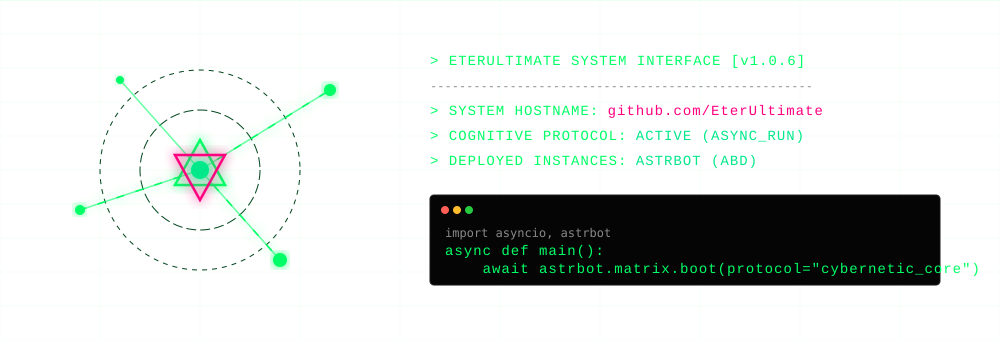
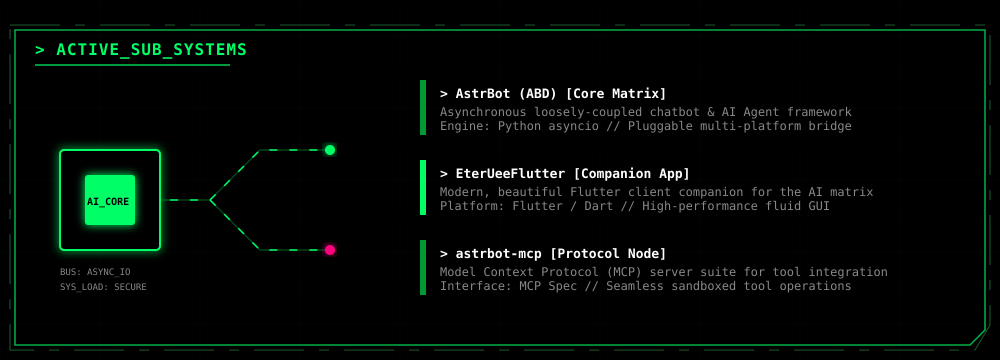
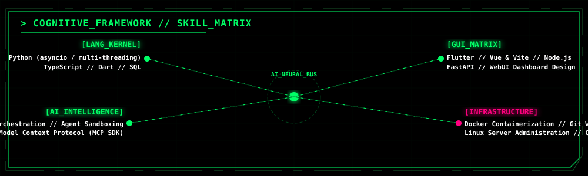

# EterUltimate

<!-- Custom Cyberpunk Terminal Console Banner -->

  

<!-- Subsystems Mainframe SVG -->

  

<!-- Customized Noir Stats Board -->

   
  

    
    &nbsp;&nbsp;&nbsp;&nbsp;
    
  

<!-- Skill Matrix Constellation SVG -->

  

<!-- Clickable Social Ports SVG -->

  

---

  <code style="color: #888888;">// CONNECTION STATUS: SECURE // CONSOLE TERMINATED. READY FOR COMMAND_</code>

